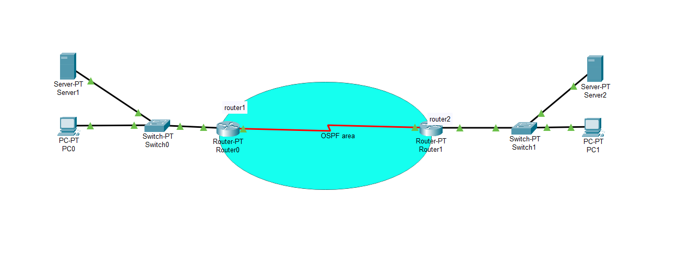
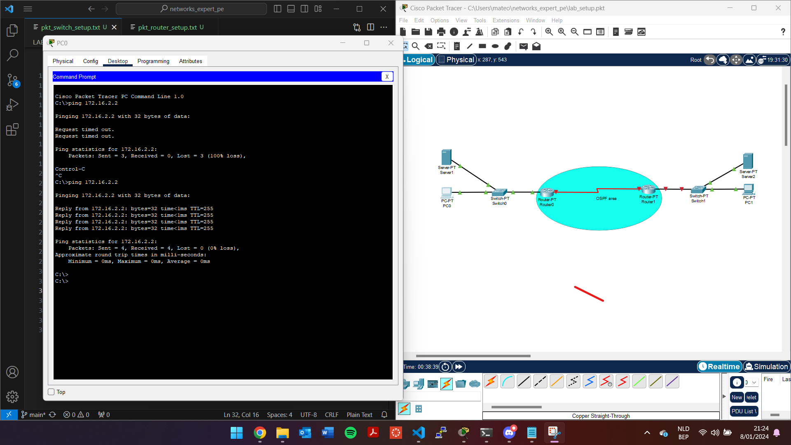
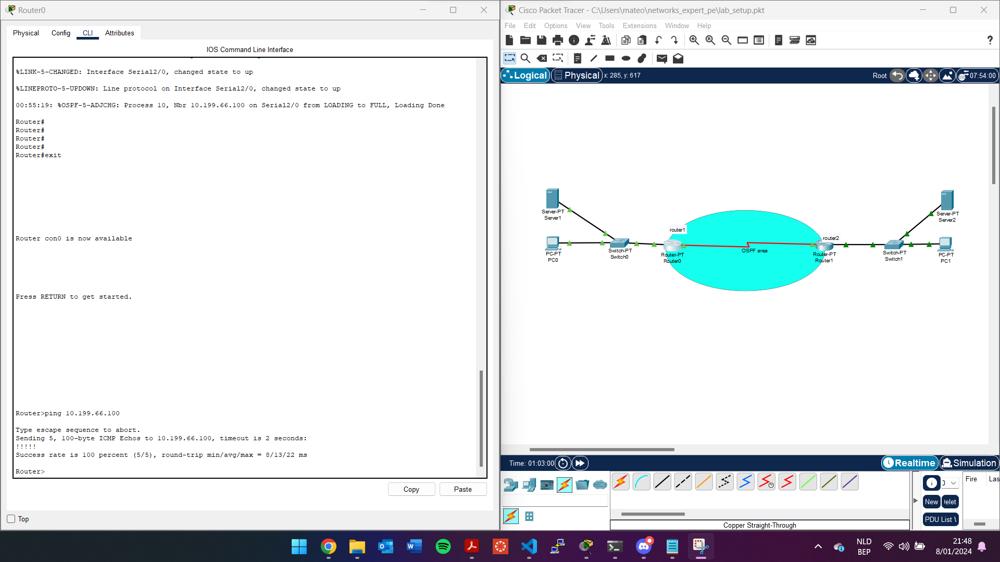

# LAB 3 - Lemmens Mateo

## Inhoudsopgave
1. [Opstelling](#opstelling)
   - [Switch](#switch)
   - [Router](#router)
2. [Switch](#switch)
3. [Router](#router)
4. [Doel van de Opstelling](#doel-van-de-opstelling)

## Opstelling
Voor dit lab had ik al configuraties van in de les. Om deze verder af te werken, heb ik een eenvoudige setup gemaakt. Vooral OSPF moest nog getest worden. Ik heb dus specifiek voor dit lab een configuratiebestand gemaakt. Ik heb ook de labbestanden, maar omdat de interfaces van de praktijklessen en de apparaten in Packet Tracer verschillend zijn, heb ik deze opgedeeld.

### Switch
Voor dit lab heb ik dezelfde IP-adressen gebruikt als die we in de lessen en bij de studentenracks gebruiken.

De echte template die we op de infrastructuur van de school gaan gebruiken, zal standaardonderdelen instellen zoals vereist in de opdracht. SSH, Spanning Tree, ACL, de benodigde VLAN's en een trunk naar de router. Dit alles werkt en is ook getest op de schoolinfrastructuur. Daarnaast heb ik een lichtgewicht versie gemaakt specifiek voor Packet Tracer, om een configuratie te maken voor het testen van OSPF. (pkt_switch_setup.txt)

Om deze werking te testen heb ik de pc's een static ip gegeven van in de bijhorenden vlan range. 

### Router
De router heeft een vergelijkbaar verhaal. Ik had al standaardonderdelen ingesteld op de router in de school, waaronder SSH, ... (router_lab_01_template.txt)

Ook hier heb ik weer een lichtgewicht versie gemaakt voor de router die bij mijn rack hoort en voor de andere router (.100) die de tegenhanger is.

router1 is dus mijn router uit de studenten rack en eindigt op ip .103 zoals aangegeven in het ip plan
router2 is de router van de school deze is de .100 zoals verder in de afbeelding kan je zien dat er connectie is door de ping tussen beide.

## Doel van de Opstelling
Het doel van mijn opstelling was om de OSPF-verbinding tussen de twee routers op te zetten, een ping te krijgen en ervoor te zorgen dat de pc's naar elkaar kunnen pingen.

