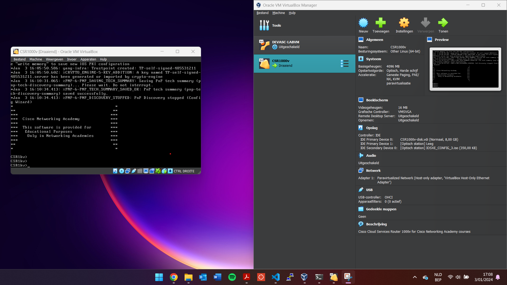
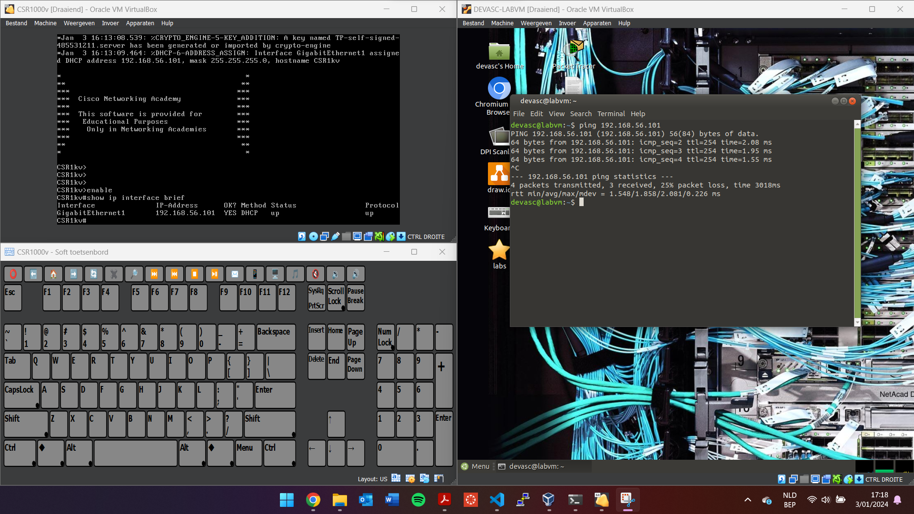
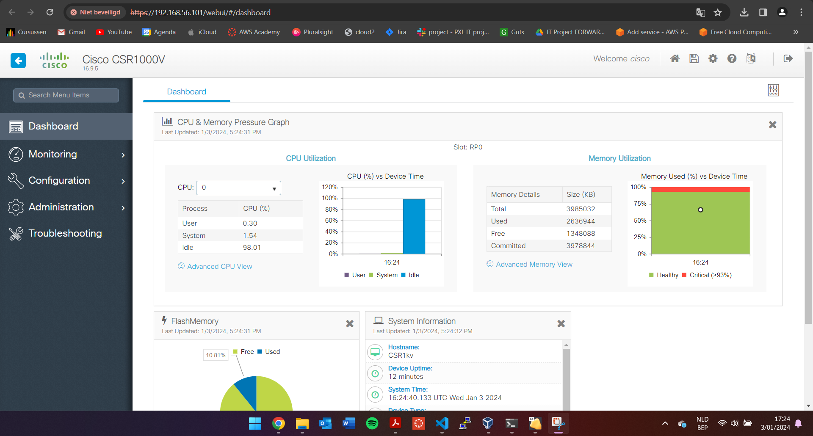

# LAB 3 - Lemmens Mateo

## Inhoudsopgave

1. [Installatie van virtuele lab-omgeving](#part-1-installatie-van-virtuele-lab-omgeving)
2. [Installatie van de CSR1000v VM](#part-2-installatie-van-de-csr1000v-vm)
3. [Python Netwerkautomatisering met NETMIKO](#part-3-python-netwerkautomatisering-met-netmiko)

## Part 1: Installatie van virtuele lab-omgeving
Ik heb de stappen in Part 1 gevolgd en de workervm geïnstalleerd. Hierop staan handige tools zoals Visual Studio Code, Postman, ... voor het maken van de labs. Ik heb alle oefeningen in VirtualBox gedaan, niet in VMware. Deze stap was makkelijk te volgen; je hoefde alleen de VM-configuratie te downloaden en importeren.

## Part 2: Installatie van de CSR1000v VM
Ik ben verder gegaan met het opzetten van de virtuele router (CSR1000v VM). Allereerst heb ik de router in VMware geïmporteerd. Daarna heb ik het eerste diskapparaat de ISO-afbeelding gegeven die in de OneDrive stond. Vervolgens heb ik de router opgestart (afbeelding 1). Na de installatie heb ik via 'enable' en het commando `show ip interface brief` het IP-adres gevonden. Daarna heb ik via de Ubuntu VM een SSH-login gedaan op de router (afbeelding 2). Als laatste setup-stap ben ik naar het IP-adres gesurft om de gebruikersinterface van de router te bekijken (afbeelding 3). Alle setups zijn nu klaar.





Belangrijk: De router heeft QWERTY als toetsenbordinstellingen. Omdat ik AZERTY heb, zal ik alle commando's in de komende labs via de SSH-verbinding vanaf de Ubuntu VM uitvoeren. Hierin heb ik de toetsenbordindeling gewijzigd naar AZERTY.

## Part 3: Python Netwerkautomatisering met NETMIKO
Om de oefeningen van Part 3 te kunnen uitvoeren, heb ik een tweede router aangemaakt, exact dezelfde stappen als bij router 1. Ik heb de verschillende onderdelen opgesplitst in vier vaak gebruikte functies:
- 1: `send_show_commands` => stuurt een show commando en slaat de inhoud hiervan op in een bestand op de pc.
- 2: `send_config_commands` => stuurt een lijst van commando's door om te configureren op het device.
- 3: `read_commands_from_file` => leest een config bestand in en voert de commando's via de vorige functie uit op het device.
- 4: `backup_device_config` => voert een show van de running config uit en slaat deze op als backup in een bestand op de pc.

### Dictionary:
Ik heb de informatie die nodig is voor de connectie opgeslagen in een dictionary per router. Op deze manier kan ik er doorheen lopen of specifiek één device gebruiken.

### Werking:
Elke functie werkt op dezelfde manier. Boven aan het bestand importeren we `ConnectHandler` van Netmiko. Dit werkt als volgt:
```
 with ConnectHandler(**device) as conn:
        output = conn.send_config_set(commands)
```
We zetten een SSH-verbinding op naar het betreffende device. Deze connectie krijgt een naam, in ons geval `conn`. Aan deze connectie kunnen we vervolgens verschillende onderdelen meegeven, bijvoorbeeld `conn.send_config_set(list_of_commands)`. Dit stuurt een lijst van commando's over de connectie die vervolgens op het device worden uitgevoerd.

### Main:
In de `main`-functie zijn er dan device-specifieke configuraties om met een `if`-statement te werken, en wordt er gebruik gemaakt van `for`-loops om bijvoorbeeld een functie op elk device uit de dictionary uit te voeren.

Ik heb ervoor gekozen om in elke functie een nieuwe connectie te starten. Anders zou de connectie te lang open blijven staan en zou ik een timeout krijgen.
