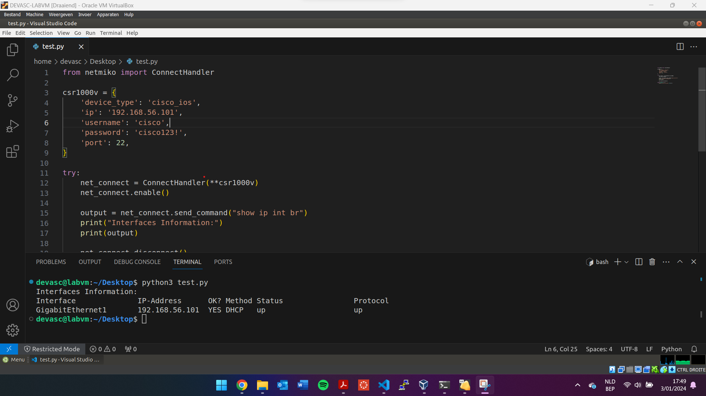
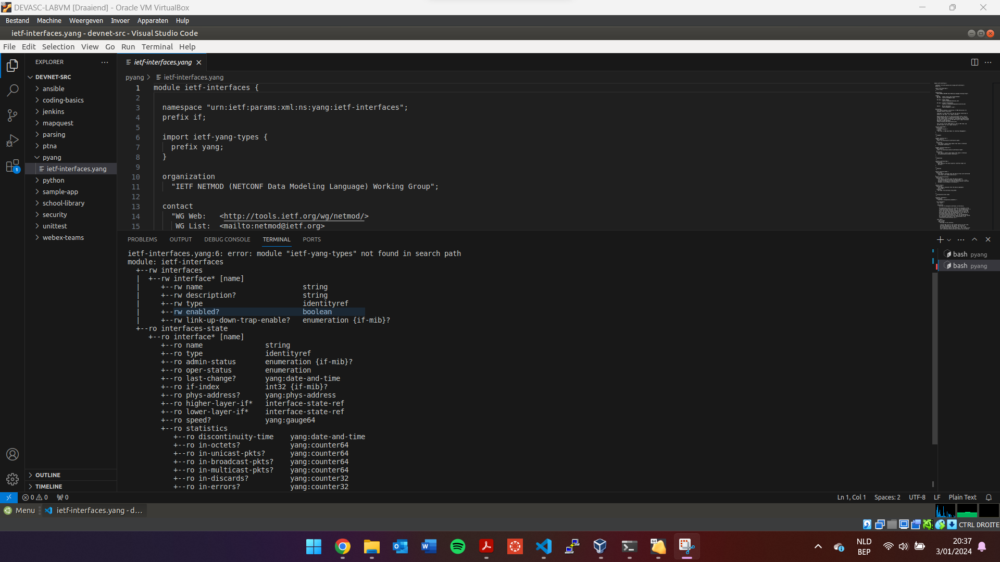
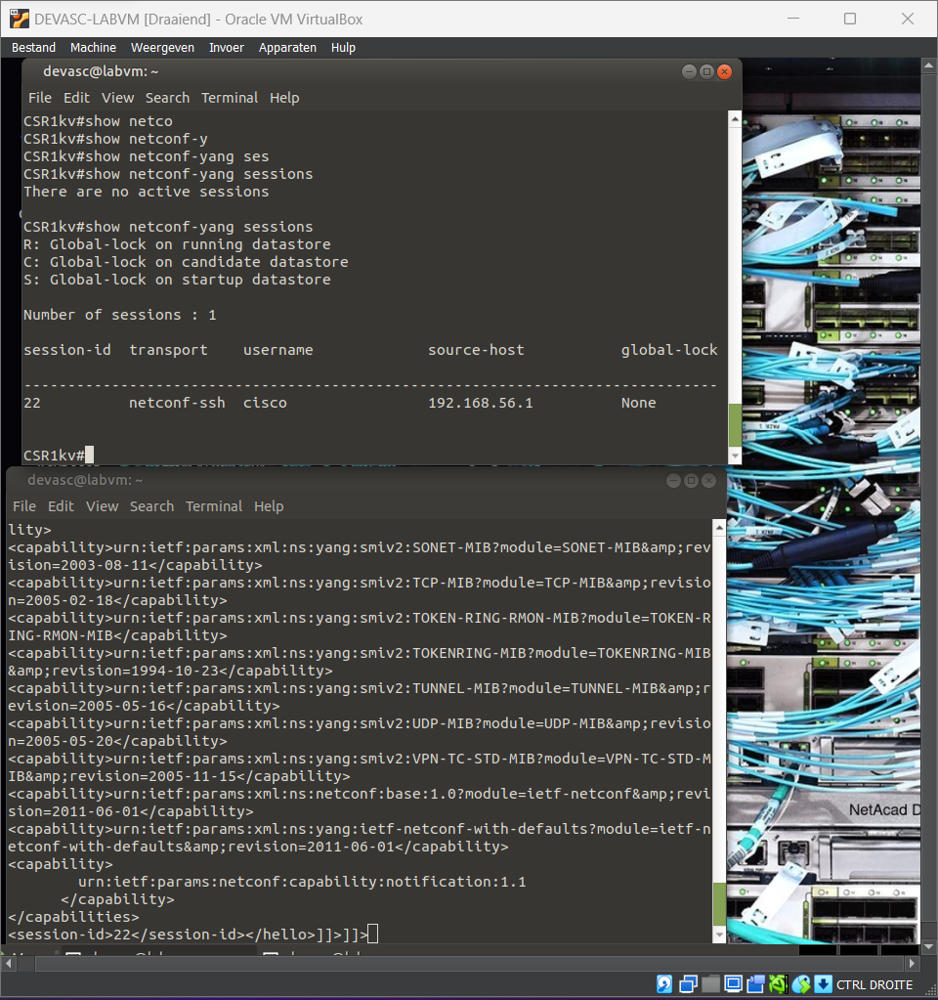
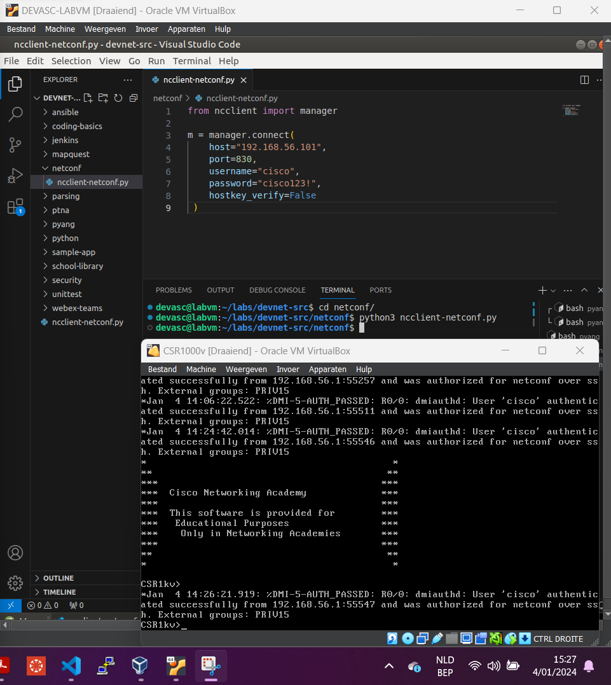
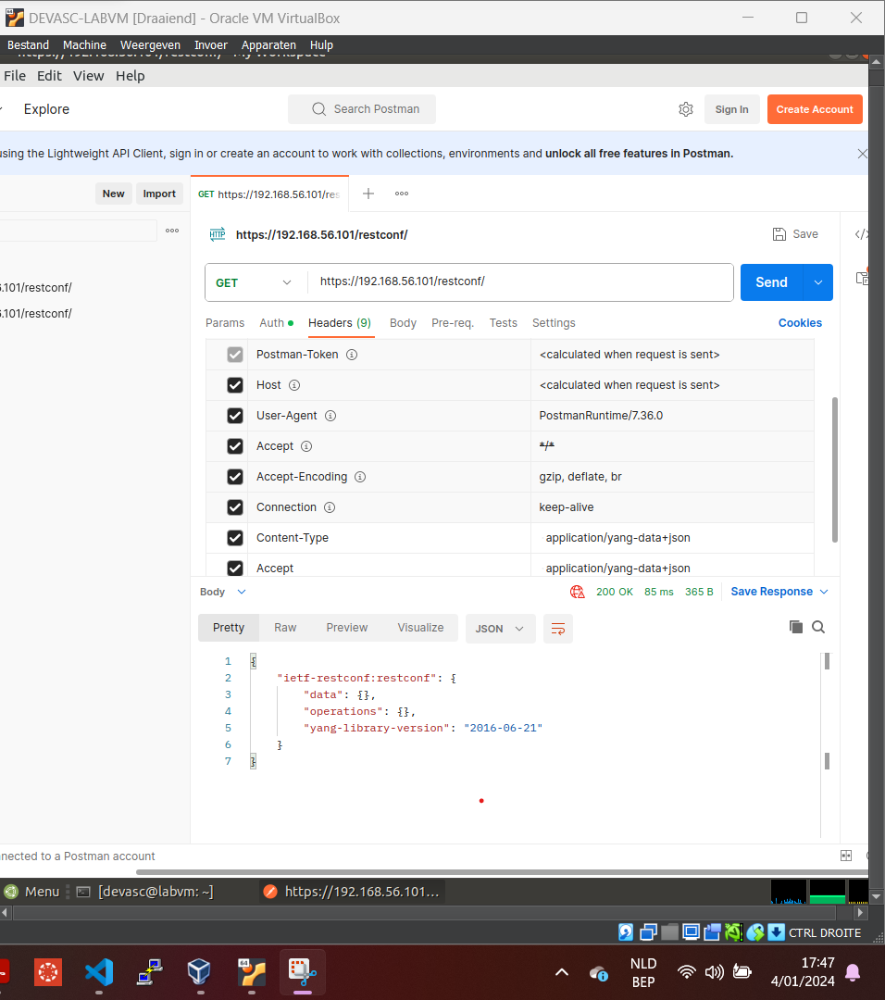
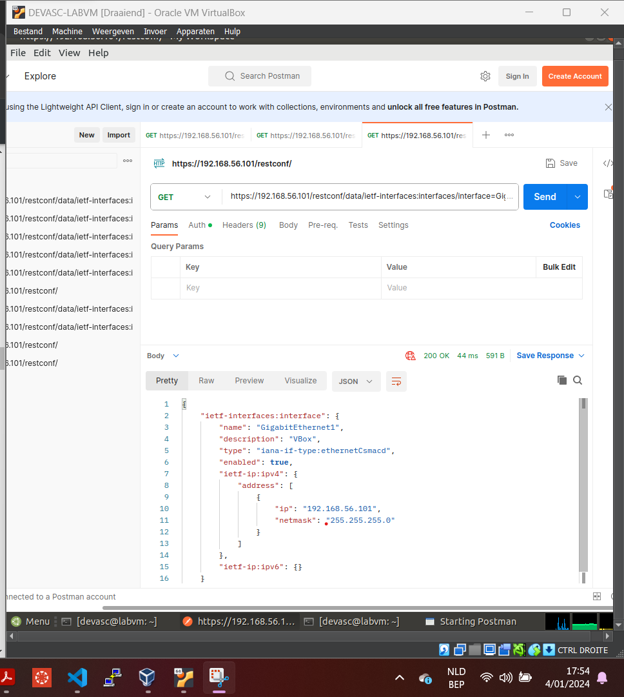
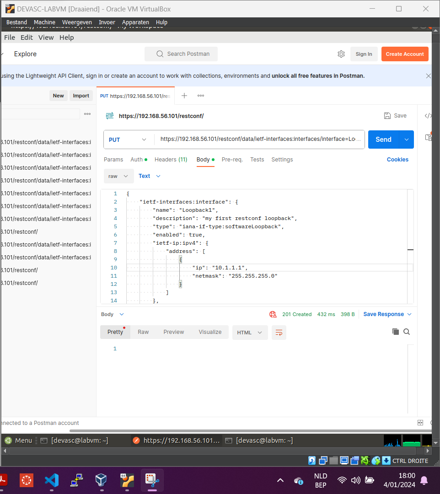
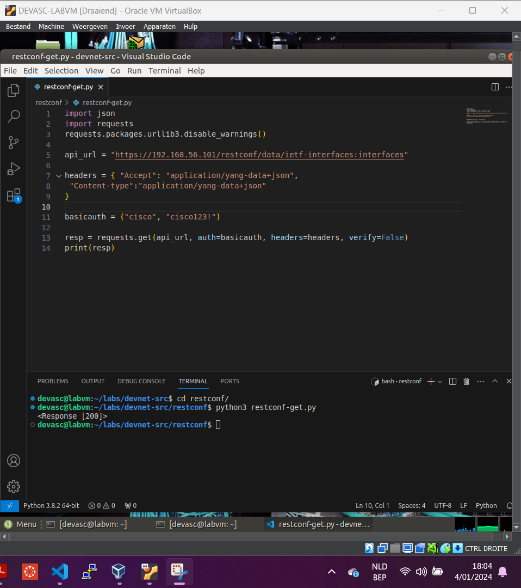
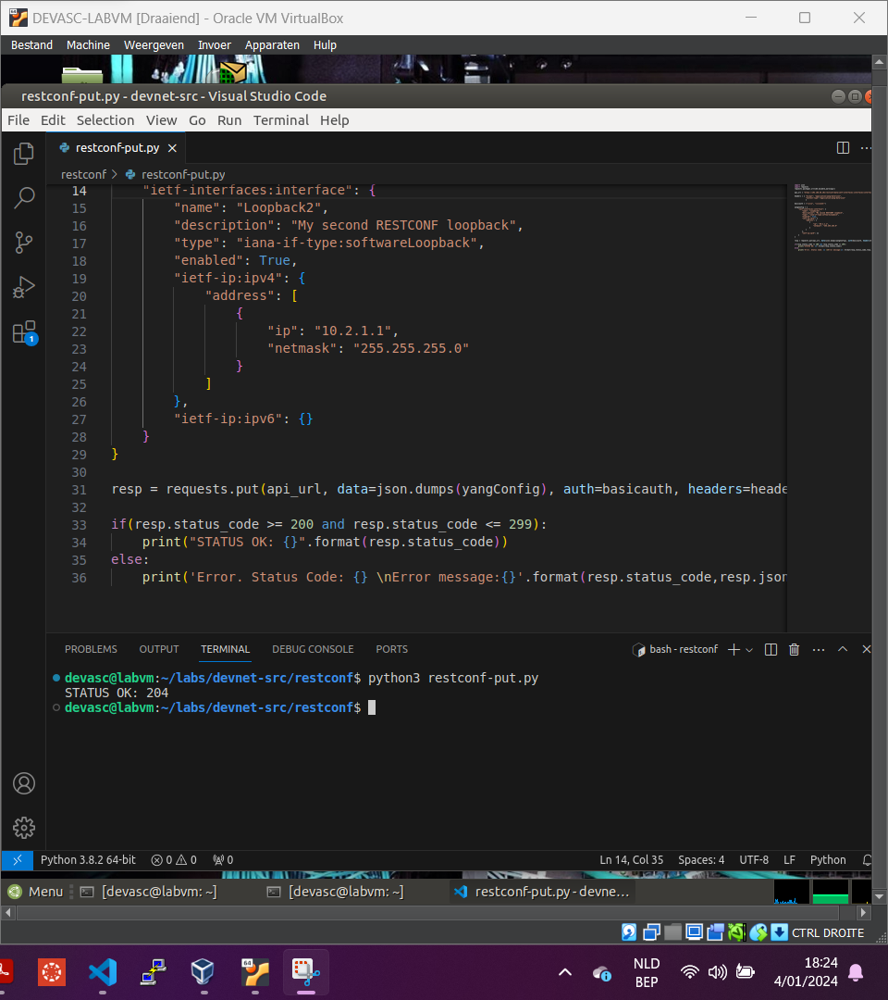

# LAB 3 - Lemmens Mateo

## Inhoudsopgave

1. [Installatie van virtuele lab-omgeving](#part-1-installatie-van-virtuele-lab-omgeving)
2. [Installatie van de CSR1000v VM](#part-2-installatie-van-de-csr1000v-vm)
3. [Python Netwerkautomatisering met NETMIKO](#part-3-python-netwerkautomatisering-met-netmiko)

## Part 1: Installatie van virtuele lab-omgeving
Ik heb de stappen in Part 1 gevolgd en de workervm geïnstalleerd. Hierop staan handige tools zoals Visual Studio Code, Postman, ... voor het maken van de labs. Ik heb alle oefeningen in VirtualBox gedaan, niet in VMware. Deze stap was makkelijk te volgen; je hoefde alleen de VM-configuratie te downloaden en importeren.

## Part 2: Installatie van de CSR1000v VM
Ik ben verder gegaan met het opzetten van de virtuele router (CSR1000v VM). Allereerst heb ik de router in VMware geïmporteerd. Daarna heb ik het eerste diskapparaat de ISO-afbeelding gegeven die in de OneDrive stond. Vervolgens heb ik de router opgestart (afbeelding 1). Na de installatie heb ik via 'enable' en het commando `show ip interface brief` het IP-adres gevonden. Daarna heb ik via de Ubuntu VM een SSH-login gedaan op de router (afbeelding 2). Als laatste setup-stap ben ik naar het IP-adres gesurft om de gebruikersinterface van de router te bekijken (afbeelding 3). Alle setups zijn nu klaar.


Belangrijk: De router heeft QWERTY als toetsenbordinstellingen. Omdat ik AZERTY heb, zal ik alle commando's in de komende labs via de SSH-verbinding vanaf de Ubuntu VM uitvoeren. Hierin heb ik de toetsenbordindeling gewijzigd naar AZERTY.

## Part 3: Python Netwerkautomatisering met NETMIKO
Om de oefeningen van Part 3 te kunnen uitvoeren, heb ik een tweede router aangemaakt, exact dezelfde stappen als bij router 1. Ik heb de verschillende onderdelen opgesplitst in vier vaak gebruikte functies:
- 1: `send_show_commands` => stuurt een show commando en slaat de inhoud hiervan op in een bestand op de pc.
- 2: `send_config_commands` => stuurt een lijst van commando's door om te configureren op het device.
- 3: `read_commands_from_file` => leest een config bestand in en voert de commando's via de vorige functie uit op het device.
- 4: `backup_device_config` => voert een show van de running config uit en slaat deze op als backup in een bestand op de pc.

### Dictionary:
Ik heb de informatie die nodig is voor de connectie opgeslagen in een dictionary per router. Op deze manier kan ik er doorheen lopen of specifiek één device gebruiken.

### Werking:
Elke functie werkt op dezelfde manier. Boven aan het bestand importeren we `ConnectHandler` van Netmiko. Dit werkt als volgt:
```
 with ConnectHandler(**device) as conn:
        output = conn.send_config_set(commands)
```
We zetten een SSH-verbinding op naar het betreffende device. Deze connectie krijgt een naam, in ons geval `conn`. Aan deze connectie kunnen we vervolgens verschillende onderdelen meegeven, bijvoorbeeld `conn.send_config_set(list_of_commands)`. Dit stuurt een lijst van commando's over de connectie die vervolgens op het device worden uitgevoerd.

### Main:
In de `main`-functie zijn er dan device-specifieke configuraties om met een `if`-statement te werken, en wordt er gebruik gemaakt van `for`-loops om bijvoorbeeld een functie op elk device uit de dictionary uit te voeren.

Ik heb ervoor gekozen om in elke functie een nieuwe connectie te starten. Anders zou de connectie te lang open blijven staan en zou ik een timeout krijgen.

Ik ben begonnen met een basisscript en heb vervolgens de bovenstaande onderdelen toegevoegd. Hieronder staat een screenshot van het initiële script waarmee ik ben begonnen.



## Part 4: Verken YANG-modellen
YANG is een datamodellerings-taal en staat voor "Yet Another Next Generation". Het is gebaseerd op XML en beschrijft de structuur van gegevens die kunnen worden uitgewisseld tussen beheersystemen en netwerkapparaten. Het biedt een standaard manier om gegevens te structureren, waardoor het gemakkelijker wordt om ze te vinden en te beheren. YANG-modellen vergemakkelijken ook de automatisering van netwerken.

In onze oefeningen hebben we Pyang gebruikt. We hebben een bestand gedownload van GitHub en dit gebruikt. Voor een duidelijk overzicht hebben we de 'tree'-optie gebruikt tijdens de uitvoering. Hiermee kregen we een overzichtelijke weergave.



## Part 5: Gebruik NETCONF om toegang te krijgen tot een IOS XE-apparaat
NETCONF is een protocol dat wordt gebruikt om de configuratie van netwerkapparaten te installeren, wijzigen of verwijderen, en om apparaatinformatie op te halen. Het is gebaseerd op een XML-structuur en maakt gebruik van YANG-modellen om de configuratie te structureren.

Het eerste deel, waarbij XML wordt gebruikt om bijvoorbeeld RPC's via NETCONF uit te voeren, is vaak te complex. Daarom is het gebruik van 'ncclient' veel handiger.



'ncclient' is een Python-module om apparaten via NETCONF te beheren. We gaan een Python-script maken dat een NETCONF-verbinding tot stand brengt met de methode `connect()`. Deze methode vertegenwoordigt de NETCONF-verbinding met het externe apparaat.

Vervolgens heb ik een afdrukfunctie toegevoegd om de servermogelijkheden af te drukken. Hiermee krijg je een lijst met alle NETCONF-mogelijkheden van dat apparaat.

Om de configuratie van het apparaat op te vragen, gebruiken we de `get_config()`-functie via de NETCONF-verbinding. De XML die we terugkrijgen, is vaak niet goed geformatteerd. Daarom hebben we de XML opgeschoond met behulp van de extra bibliotheek `import xml.dom.minidom`. Het resultaat is dat we nu met een Python-script de configuratie van het apparaat via NETCONF kunnen ophalen en in een nette XML-indeling kunnen weergeven.

We kunnen ook zoeken in het YANG-model. NETCONF maakt gebruik van het YANG-model en binnen de Python-module hebben we de mogelijkheid om in dit gestructureerde datamodel (YANG) naar specifieke configuraties te zoeken. Dit doen we met de functie `get_config()`, waarbij we een filtervariabele maken en deze toepassen.

Tot slot heb ik onderzocht hoe we apparaten kunnen configureren via 'ncclient', wat weer mogelijk is door de functie `edit_config()`.



Samenvatting:

We gebruiken NETCONF om apparaten te configureren, waarbij we gebruikmaken van het YANG-datamodel. Om dit flexibel te maken, kunnen we in Python de module 'ncclient' gebruiken. Deze module maakt een NETCONF-verbinding mogelijk, die wordt vertegenwoordigd door een variabele. Daarna kunnen we aan die verbinding methoden koppelen om bewerkingen uit te voeren, bijvoorbeeld `get_config(xml_structuur_var)` om de configuratie op te vragen. Let erop dat we de XML-structuur die we willen uitvoeren in een variabele plaatsen en deze aan de functies doorgeven.

## Deel 6: Gebruik RESTCONF om toegang te krijgen tot een IOS XE-apparaat

RESTCONF is een subset van NETCONF en biedt de mogelijkheid om een netwerkapparaat te configureren via RESTful API's. De gegevens kunnen in XML of JSON zijn. Het is iets eenvoudiger dan NETCONF en meer voor de hand liggend omdat REST API veel wordt gebruikt.

Als eerste heb ik een basis API-oproep gedaan om te testen of de verbinding werkt. Uiteraard moeten de inloggegevens correct worden ingesteld onder authenticatie. Daarnaast moeten ook de headers correct worden ingesteld.



Om nu specifieker informatie over een bepaald onderdeel in de configuratie op te vragen, kun je het pad van de URL aanpassen. Zo kun je bijvoorbeeld een aanvraag doen voor de configuratie van Gigabit-poort 1 via `https://192.168.56.101/restconf/data/ietf-interfaces:interfaces/interface=GigabitEthernet1`. Omdat deze op DHCP staat, zie ik niets. Dus heb ik het even handmatig geconfigureerd. Als we dan opnieuw een oproep doen, zie je de configuratie van G1.



Tot nu toe heb ik GET gebruikt om informatie op te halen. Natuurlijk kun je ook PUT en POST gebruiken om configuraties aan te passen.



Nu gaan we bekijken hoe we dit kunnen toepassen in een Python-script. Postman is handig om snel zaken te testen, maar als we willen automatiseren, zullen we een script gebruiken.

Het script bestaat uit enkele standaardonderdelen. We importeren modules en maken verschillende variabelen:
- 1: `api_url`: de basis-URL naar de router.
- 2: `headers`: gegevens om de headers in het verzoek correct in te stellen.
- 3: `basicauth`: de referenties om toegang te krijgen (gebruikersnaam, wachtwoord).

Via de functie 'request' geven we verschillende parameters door die hierboven zijn vermeld. Hiermee wordt een REST API-oproep gemaakt naar het apparaat, en de reactie wordt opgeslagen en afgedrukt. In mijn geval was het een 200, wat betekent dat we een goede verbinding hebben. Daarna kun je spelen om de JSON-uitvoer op te schonen.



Daarna hebben we een tweede script gemaakt om een PUT-verzoek te kunnen doen. Dit script is zeer vergelijkbaar, alleen wordt een andere functie gebruikt om een PUT-verzoek in plaats van een GET-verzoek te doen. We maken eerst een variabele aan die JSON bevat voor de configuratie. Deze wordt vervolgens doorgegeven aan een functie via PUT-verzoek en naar het apparaat gestuurd.



