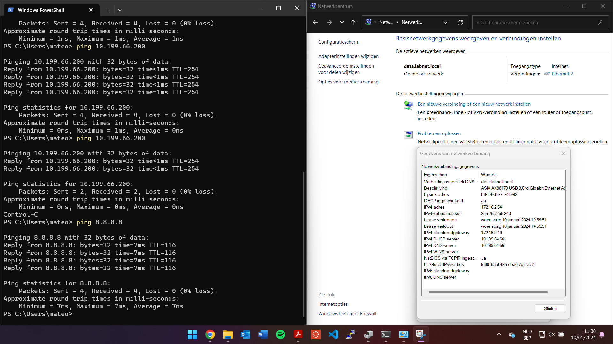
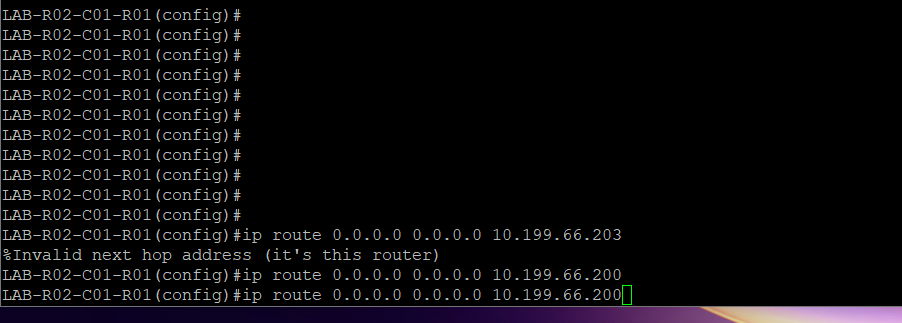
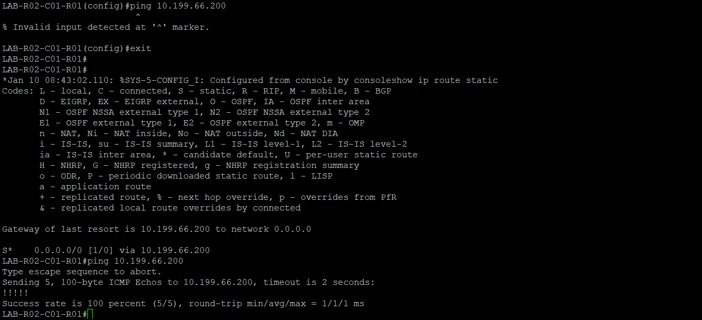
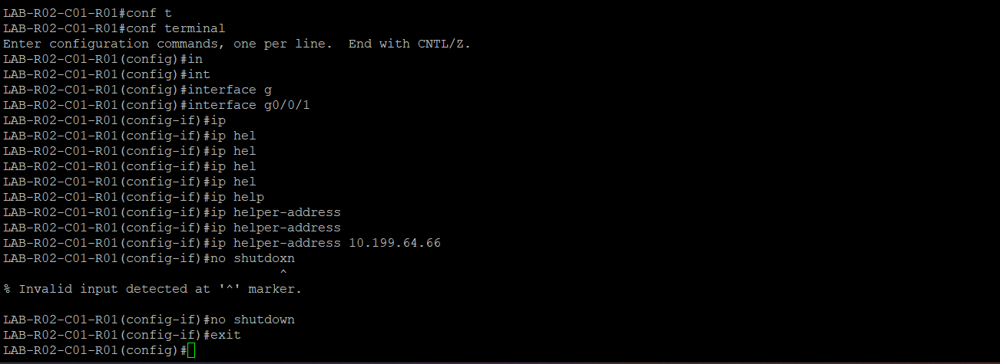
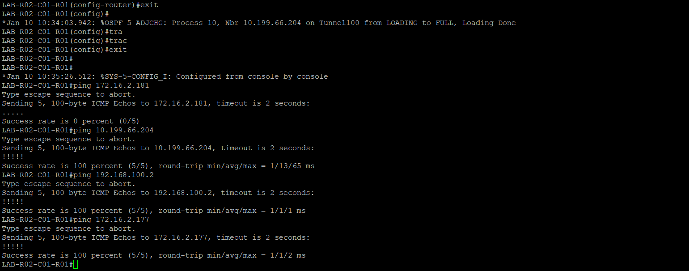
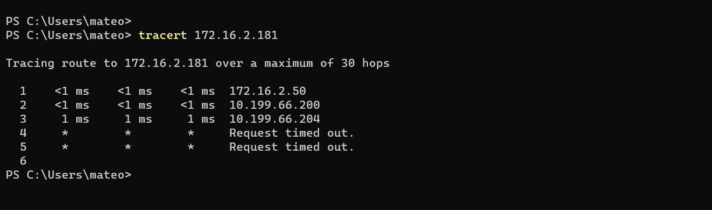

Eerst hebben we de basisconfiguratie opgezet via een statische route. Hierbij verkreeg mijn laptop een IP-adres via DHCP en kon ik een ping uitvoeren naar Google op 8.8.8.8.

Daarna hebben we de standaardroute toegevoegd:

Vervolgens hebben we een ping uitgevoerd naar de router in het datacenter:

Na het toevoegen van de DHCP-helper zijn we een tunnel gaan opzetten:

Ten slotte hebben we de tunnel getest door een ping naar de tunnelbestemming uit te voeren:

Dit was de laatste stap in ons proces, waarbij ik met succes de bestemming van de tunnel kon pingen:

